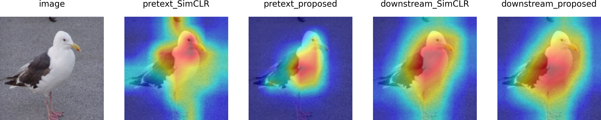
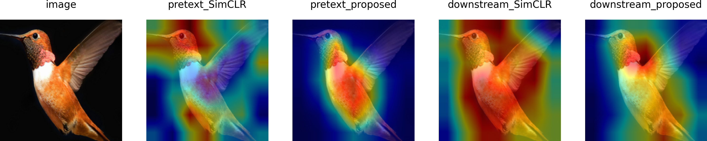
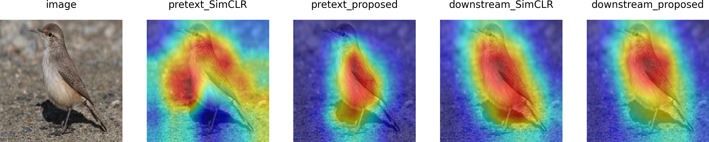

# Self-supervised-with-object-structure-information
Implementation of "Self-Supervised Object Structure Learning for Image Classification and Segmentation" paper


## Description


This project is implementation of self-supervised learning with object structure information. 


 


## Get Start


Implementations of image classification are in [classification/](./classification/).

Implementations of semantic segmentation are in [segmentation/](./segmentation/).


## Result







## Citation


cite

```python

```
